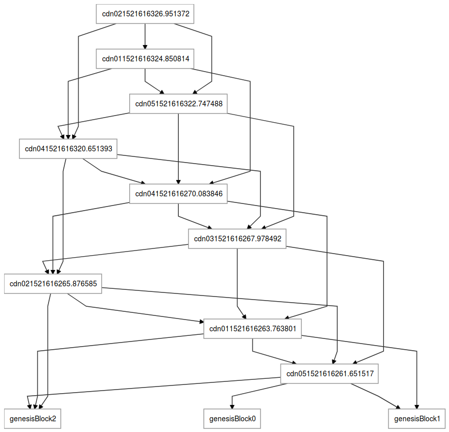
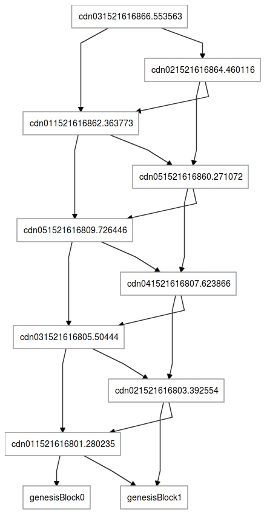

# LogDAG
Storing log data in a Directed Acyclic Graph

Part of a research project for CCF for os3.nl

## Example graphs

In `logdag.py` there is `config.links`,
which specifies how many links a block will have.

### 3 links

### 2 links

